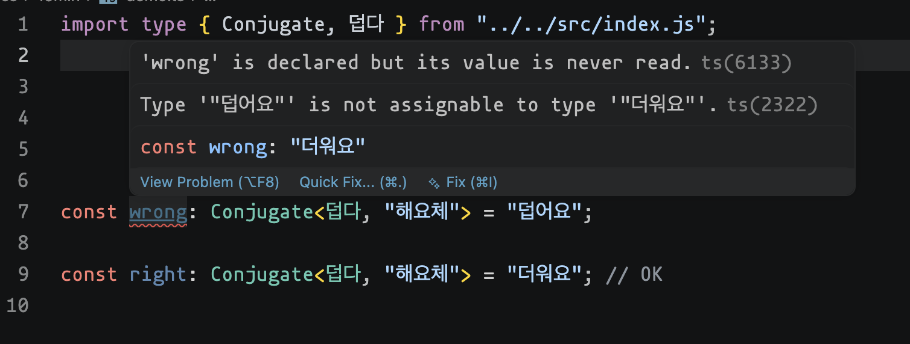
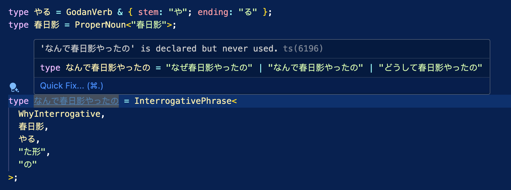
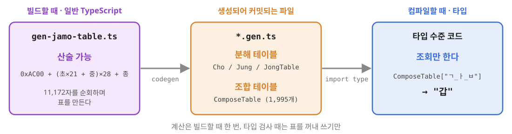
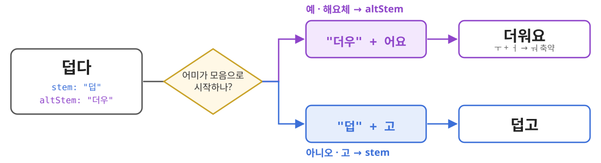
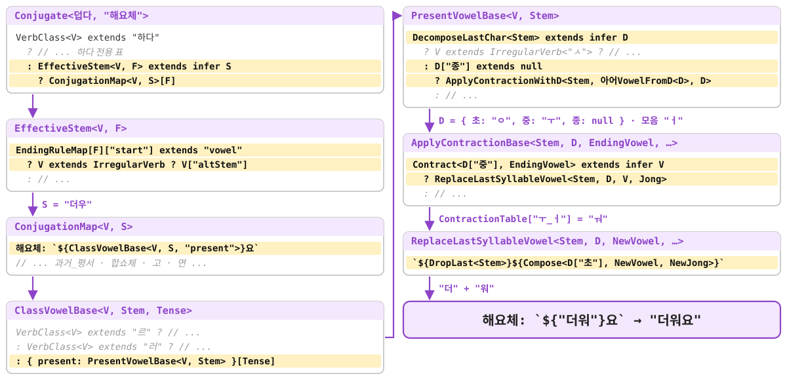
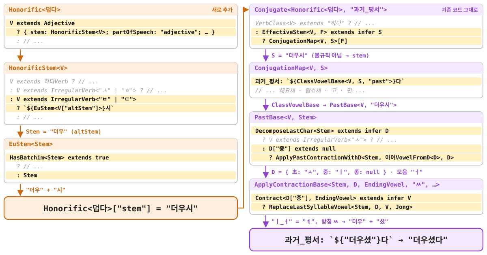
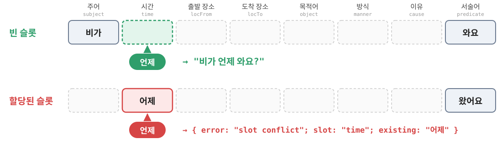

<!-- _class: lead -->
<!-- _paginate: false -->

# typed-korean

### `덥다`는 어떻게 `더워요`가 되는가

<span class="small">한국어 활용 규칙을 TypeScript 타입 시스템만으로</span>

<!--
[0:00–0:30]
안녕하세요. 한국어 활용 규칙을 TypeScript 타입 시스템만으로 구현한 typed-korean을 소개하겠습니다.
오늘은 기능을 하나씩 소개하지 않고, "덥다"가 어떻게 "더워요"가 되는지 계산 하나만 처음부터 끝까지 따라가 보겠습니다.
-->

---

<style scoped>section { place-content: start; } img { margin: 0 0 0.5em; border-radius: 50%; }</style>


- Twitter: https://x.com/JoonNot
- GitHub: https://github.com/notJoon
- 프로젝트: https://github.com/notJoon/typed-korean

<!--
간단히 제 소개를 드리겠습니다.
-->

---

## 결과부터

```ts
const wrong: Conjugate<덥다, "해요체"> = "덥어요";
//    ^ error TS2322: Type '"덥어요"' is not assignable to type '"더워요"'.

const right: Conjugate<덥다, "해요체"> = "더워요"; // OK
```

<br>

<p class="big">컴파일러는 정답이 "더워요"라는 걸 어떻게 알았을까?</p>



<!--
[0:30–1:25]
결과부터 보여드리겠습니다.
"덥다"를 해요체로 활용한 타입에 "덥어요"를 넣으면 컴파일 에러가 납니다. 에러 메시지를 보면 정답이 "더워요"라고 알려 줍니다.
"더워요"를 넣으면 통과합니다.
"먹다"는 "먹어요"가 되지만, "덥다"는 ㅂ 불규칙이라서 "더워요"가 됩니다.
그러면 컴파일러는 정답이 "더워요"라는 걸 어떻게 알았을까요? 오늘 발표는 이 질문 하나에 답하는 발표입니다.
-->

---

## 목표와 제약

- 런타임 코드 없이 타입 검사만 활용
- 컴파일 시점의 **문자열 리터럴**만 다룬다
- 실용적인 목적 X

<span class="small">typed-japanese (https://github.com/typedgrammar/typed-japanese)</span>



<!--
[1:25–1:50]
범위를 먼저 정하겠습니다. 런타임 없이 컴파일 시점의 문자열 리터럴만 다루는 표현력 실험입니다. 실제 사용자 입력을 검사하는 교정기는 아닙니다.
일본어로 같은 실험을 한 typed-japanese에서 영감을 받았습니다.
-->

---

## 타입 시스템의 핵심 도구

```ts
// 1. 문자열 만들기
type Greet<N extends string> = `FUR:RAID is ${N}`;
type G = Greet<"fun">;                  // "FUR:RAID is fun"

// 2. 분기와 패턴 매칭
type Last<S> = S extends `${string}${infer C}` ? C : never;
type L = Last<"덥다">;                   // "다"

// 3. 표 조회
type Table = { ㅜ_ㅓ: "ㅝ"; ㅗ_ㅏ: "ㅘ" };
type R = Table["ㅜ_ㅓ"];                 // "ㅝ"
```

→ 이후 나오는 코드는 전부 **조립 · 분기 · 패턴 매칭 · 조회**의 조합

<!--
[1:50–3:00]
TypeScript를 잘 모르셔도 괜찮습니다. 오늘 필요한 도구는 몇 가지뿐입니다.
첫째, 문자열 타입을 조립할 수 있습니다. Greet에 "fun"를 넣으면 "FUR:RAID is fun"라는 타입이 나옵니다.
둘째, 조건부 타입과 infer로 분기하고 문자열을 쪼갤 수 있습니다. 여기서는 "덥다"의 마지막 글자 "다"를 꺼냅니다.
셋째, 객체 타입을 표처럼 조회할 수 있습니다. "ㅜ_ㅓ"로 조회하면 "ㅝ"가 나옵니다.
문법을 외우실 필요는 없습니다. 타입 시스템에는 문자열 조립, 분기, 패턴 매칭, 표 조회가 있고, 이후에 나오는 코드는 전부 이 네 가지의 조합이라는 것만 기억해 주세요.
-->

---

<style scoped>pre { font-size: 1em; }</style>

## 한국어 활용 규칙, 한 장으로

<div class="cols">
<div>

```text
덥다
 └─ 어간: 덥
 └─ 모음 어미 앞에서: 더우
 └─ 더우 + 어요
 └─ ㅜ + ㅓ = ㅝ
 └─ 더워요
```

</div>
<div>

- **받침** 여부에 따라 결합 방식이 달라진다
  먹 + 어요 → 먹어요 / 가 + 아요 → 가요
- 마지막 **모음**에 따라 아/어를 고른다
- 모음끼리 만나면 **축약**된다
  주 + 어요 → 줘요
- 일부 단어는 모음 어미 앞에서 **어간이 바뀐다**

</div>
</div>

<!--
[3:00–4:00]
이제 한국어 쪽 규칙입니다. 오늘 필요한 규칙은 네 개입니다.
받침 여부에 따라 결합 방식이 달라지고, 마지막 모음에 따라 "아"나 "어"를 고릅니다. 모음끼리 만나면 "주 + 어요 → 줘요"처럼 축약됩니다. 일부 단어는 모음 어미 앞에서 어간 자체가 바뀝니다.
왼쪽이 오늘 따라갈 경로입니다. "덥다"의 어간은 "덥"인데, 모음 어미 앞에서 "더우"로 바뀝니다. 여기에 "어요"가 붙고, ㅜ와 ㅓ가 ㅝ로 축약되어 "더워요"가 됩니다.
-->

---

## 첫 번째 벽: 코드포인트를 직접 계산할 수 없다



```ts
type D = DecomposeLastChar<"먹">;  // { 초: "ㅁ"; 중: "ㅓ"; 종: "ㄱ" }
type C = Compose<"ㅂ", "ㅘ", "ㅆ">; // "봤"
```

<!--
[4:00–5:00]
규칙을 보면 ㅜ와 ㅓ처럼 글자를 자모 단위로 쪼개야 합니다. 그런데 여기서 첫 번째 벽을 만났습니다.
유니코드에서 한글 음절은 초성, 중성, 종성 번호를 곱하고 더해 코드포인트를 구합니다. 예를 들어 "봤"은 ㅂ 7, ㅘ 9, ㅆ 20을 넣으면 0xAC00 + (7×21 + 9)×28 + 20 = U+BD24가 나옵니다. 그런데 TypeScript 타입 시스템에는 코드포인트를 얻거나 직접 산술하는 기본 연산이 없습니다.
그래서 계산을 데이터로 바꿨습니다. 빌드할 때 분해·조합 테이블을 미리 생성하고, 타입에서는 조회만 합니다. 그 결과 "먹"을 자모로 분해하고 ㅂ, ㅘ, ㅆ을 "봤"으로 조합할 수 있습니다.
오늘 기억하실 건 "산술을 데이터 조회로 바꿨다"는 결정 하나입니다.
-->

---

## 음절 분해: 테이블 역방향 검색으로

```ts
// 생성된 테이블 (일부)
type ChoTable  = { "ㄱ": "가각갂갃간…"; "ㄴ": "나낙낚…"; … };
type JongTable = { "NULL": "가개갸…"; "ㄱ": "각객갹…"; … };

// "이 글자를 포함한 키는?" → 매핑된 타입으로 검색
type FindContainingKey<T, C extends string> = {
  [K in keyof T]: T[K] extends `${string}${C}${string}` ? K : never;
}[keyof T];
```

- 분해 테이블: 자모별 긴 문자열 하나에 11,172자 전체
- 조합 테이블: 받침을 ㄴ · ㄹ · ㅂ · ㅆ · 없음으로 제한해 1,995개

참고: https://hackers.pub/@joonnot/2026/typed-korean-jamo-table-inversion

<!--
분해는 테이블을 거꾸로 검색합니다. 모든 키를 돌면서 값 문자열에 그 글자가 들어 있는 키만 남깁니다. 초성, 중성, 종성 테이블에 각각 물어보면 분해가 됩니다.
테이블이 크면 컴파일이 느려질 수 있어서, 음절 11,172개를 거대한 유니온으로 만들지 않고 자모별 긴 문자열로 묶었습니다. 조합 테이블도 엔진이 실제로 붙이는 받침만 넣어 1,995개로 줄였고, 지금 전체 타입 검사는 1초 정도입니다.
자세한 과정은 블로그 링크를 참고해 주세요.
-->

---

<style scoped>pre { font-size: 0.95em; }</style>

## 활용 파이프라인

```text
동사 + 어미
    ↓
실제로 사용할 어간 선택  ← ㅂ·ㄷ 불규칙은 여기서 끝
    ↓
마지막 음절 분해  (DecomposeLastChar)
    ↓
모음조화 · 축약 규칙 조회  (ContractionTable)
    ↓
음절 재조합  (Compose)
    ↓
"더워요"
```

<!--
[5:00–5:50]
이 도구들로 만든 활용 엔진은 이런 파이프라인입니다.
동사와 어미가 들어오면, 먼저 이 어미 앞에서 실제로 쓸 어간을 고릅니다. 다음으로 어간의 마지막 음절을 방금 본 테이블로 분해합니다. 분해된 모음으로 모음조화와 축약 규칙을 표에서 조회하고, 결과를 다시 음절로 조합합니다.
오늘 보는 ㅂ 불규칙은 첫 단계에서 대체 어간을 고르면 끝납니다. 다음 두 장에서 그 이유를 보겠습니다.
-->

---

## 핵심 설계: 불규칙을 계산하지 않고 저장한다

```ts
interface IrregularVerb<Type extends IrregularType, Alt extends string = string>
  extends Verb {
  irregularType: Type;
  altStem: Alt;          // 모음 어미 앞에서 쓸 어간
}

type 덥다 = Adjective & IrregularVerb<"ㅂ", "더우"> & { stem: "덥" };
```

| 단어 | 기본 어간 `stem` | 대체 어간 `altStem` |
| --- | --- | --- |
| 덥다 | 덥 | 더우 |
| 듣다 | 듣 | 들 |
| 모르다 | 모르 | 몰 |

- 엔진은 ㅂ → 우 변환을 **계산하지 않는다**
- 어휘가 어간 두 개를 주고, 엔진은 **어느 것을 쓸지만** 결정한다

<!--
[5:50–7:10]
오늘 발표의 중심 슬라이드입니다.
불규칙 동사는 일반 동사 정보에 두 가지를 더 가집니다. 어떤 불규칙인지, 그리고 대체 어간입니다. "덥다"는 기본 어간 "덥"과 대체 어간 "더우"를 가집니다.

아래 표처럼 "듣다"는 "듣"과 "들", "모르다"는 "모르"와 "몰"입니다.
변환 규칙을 타입으로 구현할 수도 있지만, 그러면 유형별 복잡도가 엔진으로 퍼집니다. 대신 변환 결과를 어휘 데이터에 저장합니다. 그러면 엔진의 질문이 "어떻게 변환하지?"에서 "둘 중 어느 어간을 쓰지?"로 바뀝니다.

앞에서 유니코드 산술을 테이블로 바꾼 것과 같은 원칙입니다. 계산하기 어려운 건 데이터로 바꿉니다.
-->

---

## `EffectiveStem`: 어미가 어간을 고른다

```ts
type EffectiveStem<V extends Verb, F extends EndingType> =
  EndingRuleMap[F]["start"] extends "vowel"
    ? V extends IrregularVerb<IrregularType> ? V["altStem"] : V["stem"]
    : V["stem"];
```



→ ㅂ·ㄷ 불규칙의 어간 교체는 **이 갈림길 한 곳**에 격리된다

<!--
[7:10–8:10]
어느 어간을 쓸지는 EffectiveStem이 정합니다. 코드를 한 줄씩 읽기보다 아래 그림으로 보겠습니다.
어미마다 모음으로 시작하는지 자음으로 시작하는지가 표에 적혀 있습니다. 해요체의 "어요"는 모음으로 시작하니까, 불규칙 동사라면 대체 어간 "더우"를 고릅니다. "고"는 자음으로 시작하니까 기본 어간 "덥"을 써서 "덥고"가 됩니다.

적어도 오늘 보는 ㅂ 불규칙에서는 처리가 이 갈림길에서 끝납니다. 어간이 정해진 다음에는 규칙 동사와 같은 파이프라인을 탑니다.
-->

---

## 따라가 보기: `Conjugate<덥다, "해요체">`

<div class="cols">
<div>

| | 단계 | 결과 |
| --- | --- | --- |
| ① | 어미 확인 | `"해요체"` → 모음 어미 |
| ② | **어간 선택** | `"덥"` → **`"더우"`** |
| ③ | 마지막 음절 분해 | 우 → ㅇ + ㅜ |
| ④ | 모음조화 · 축약 | ㅜ + ㅓ → ㅝ |
| ⑤ | 재조합 | 더 + 워 + 요 → **`"더워요"`** |

</div>
<div>
<br><br>

<p class="big"><code>덥다</code>의 불규칙이 관여하는 것은</p>
<p class="big">어간 선택에서만</p>

이후 부터는 규칙 동사 `주다 → 줘요`와 같은 경로

</div>
</div>

<!--
[8:10–10:20]
이제 처음 질문으로 돌아가서, 컴파일러가 "더워요"를 어떻게 계산하는지 처음부터 따라가 보겠습니다.

첫째, 어미를 확인합니다. 해요체는 "어요"로 시작하니까 모음 어미입니다.

둘째, 어간을 고릅니다. 모음 어미이고 불규칙 동사니까 "덥" 대신 대체 어간 "더우"를 씁니다.

셋째, 마지막 음절 "우"를 생성된 테이블로 분해합니다. 초성 ㅇ, 중성 ㅜ, 받침 없음입니다.

넷째, ㅜ는 밝은 모음이 아니니까 "어"를 고르고, 축약 표에서 ㅜ와 ㅓ를 조회하면 ㅝ가 나옵니다.

다섯째, ㅇ과 ㅝ를 조합하면 "워", 앞의 "더"와 뒤의 "요"를 붙이면 "더워요"입니다.

여기서 보셨으면 하는 건, "덥다"의 불규칙이 관여하는 곳이 두 번째 단계 하나뿐이라는 점입니다. 세 번째 단계부터는 규칙 동사 "주다"가 "줘요"가 되는 경로와 완전히 같습니다.

처음에 컴파일러가 어떻게 "더워요"를 알았냐고 물었는데, 답은 이렇습니다. 어휘에 적힌 "더우"를 고르고, 나머지는 규칙 동사와 똑같이 계산했습니다.
-->

---

## 실제 코드 경로



<!--
실제 코드로는 이렇게 이어집니다. 노란 줄이 방금 따라간 경로이고, 나머지 분기는 접어 두었습니다.
-->

---

## 높임 `-(으)시-` 처리

```ts
type H = Honorific<덥다>["stem"];
// "더우시"  ← 새로운 규칙 어간

type R = Conjugate<Honorific<덥다>, "과거_평서">;
// "더우셨다"
```

- 높임 어간을 만든 뒤 **기존 활용 엔진에 다시 넣었더니** 모든 어미가 동작
- 새 규칙 테이블 추가 X

<span class="small">물론 모든 예외가 altStem 하나로 끝나지는 않는다 (ㅅ · 르 · 러 · ㅎ → 부록)</span>

<!--
[10:20–11:10]
이 설계가 확장에 유리하다는 걸 보여 주는 사례가 하나 있습니다. 최근에 높임의 "-(으)시-"를 추가했습니다.
"덥다"의 높임 어간을 만들면 "더우시"가 됩니다. 이건 "시"로 끝나는 평범한 규칙 어간입니다.
그래서 이 어간을 새 동사처럼 기존 Conjugate에 다시 넣었더니 "더우셨다"가 나왔습니다. 새 규칙 테이블 없이 기존 어미가 전부 동작했습니다.
물론 모든 예외가 대체 어간 하나로 끝나지는 않습니다. ㅅ, 르, 러, ㅎ 불규칙은 추가 분기가 조금 필요했는데, 부록에 정리해 두었습니다.
-->

---

## 실제 코드 경로: 높임



<!--
왼쪽 주황색이 새로 추가한 코드이고, 오른쪽 보라색은 앞 장과 같은 기존 코드 그대로입니다. "더우시"가 만들어진 뒤에는 기존 경로를 그대로 탑니다.
-->

---

## 한계와 교훈

1. **계산하기 어려우면 데이터로 바꾼다**
   유니코드 산술 → 생성된 테이블
2. **예외 처리를 경계에 모은다**
   ㅂ·ㄷ 불규칙의 어간 교체 → 어휘의 `altStem` + `EffectiveStem`
3. **결과를 다시 입력할 수 있게 설계한다**
   높임 어간 → 기존 활용 파이프라인

<br>

<span class="small">한계: 등록된 어휘와 컴파일 시점 리터럴만 처리 가능.</span>

<!--
[11:10–12:20]
정리하겠습니다. 배운 점은 세 가지입니다.
첫째, 계산하기 어려운 건 데이터로 바꿉니다. 직접 다루기 어려운 유니코드 산술을 생성된 테이블로 바꿨습니다.
둘째, 예외 처리를 경계에 모읍니다. ㅂ·ㄷ 불규칙의 어간 교체를 어휘의 대체 어간과 EffectiveStem에 모았습니다.
셋째, 결과를 다시 입력으로 쓸 수 있게 설계합니다. 높임 어간을 기존 파이프라인에 그대로 넣을 수 있었던 이유입니다.
한계도 분명합니다. 대체 어간을 사람이 적어야 하니까 등록된 어휘만 처리하고, 컴파일 시점의 리터럴만 다룹니다. 실제 한국어 교정기는 아닙니다.
-->

---

<!-- _class: lead -->
<!-- _paginate: false -->

# 감사합니다

### Q & A

https://github.com/notJoon/typed-korean

<!--
[12:20–15:00]
들어 주셔서 감사합니다. 질문 받겠습니다.
-->

---

<!-- _class: lead -->

# 부록

---

## 부록 A: 남는 예외들

| 유형 | 남은 문제 | 처리 |
| --- | --- | --- |
| ㅅ | `지 + 어`인데 ㅣ+ㅓ=ㅕ 축약이 일어나면 안 됨 ("져요" ✗) | 축약 건너뛰기 분기 |
| 르 | 모음조화를 `몰`이 아니라 원래 어간 `모르`의 **앞 음절**로 판단 | `르아어Vowel` + 전용 vowel base |
| 러 | 항상 `러` | 전용 vowel base |
| ㅎ | `-(으)면`에서 대체 어간이 아닌 `그러면` | `DropFinalJong` |
| 하다 | 접두 명사를 다시 붙여야 함 | 전용 테이블 `하다ConjugationMap` |

```ts
type VerbClass<V> = V extends 하다Verb ? "하다"
  : V extends IrregularVerb<"르"> ? "르"
  : V extends IrregularVerb<"러"> ? "러" : "default";
```

<!--
ㅅ 불규칙은 "지어요"인데 그냥 두면 축약돼서 "져요"가 되므로 축약을 건너뜁니다.
르 불규칙은 "몰라요"인지 "몰러요"인지를 원래 어간 "모르"의 앞 음절 모음으로 판단합니다.
ㅎ 불규칙은 조건형에서 "그러면"이 되도록 받침만 뗍니다.
분기는 VerbClass로 한 번 판정하고, 결과가 달라지는 모음 기반 계산에서만 합니다.
-->

---

## 부록 B: 조사와 문장 구조



- 조사: `[받침O, 받침X]` 튜플 + 받침 분기 한 곳 (`밥을`, `나는`)
- 문장: 역할 슬롯을 보존한 구조체 → 의문사가 들어갈 슬롯이 이미 차 있으면 에러

<!--
조사는 받침 있을 때와 없을 때의 형태를 튜플로 저장하고, 받침 분기는 한 곳에만 둡니다.
문장은 바로 문자열로 합치지 않고 주어, 시간, 목적어 같은 슬롯으로 유지합니다. 그래서 "어제 왔어요"에 "언제"를 넣으면 시간 슬롯 충돌을 에러로 알려 줄 수 있습니다.
-->

---

## 부록 C: 테스트와 성능

```ts
type _모르다 = AssertAll<ConjugateTest<모르다, [
  ["해요체",    "몰라요"],
  ["과거_평서", "몰랐다"],
  ["고",       "모르고"],
]>>;
// 틀리면 → { error: "Type mismatch"; actual: ...; expected: ... }
```

- `tsc --noEmit`이 곧 테스트 러너
- 함정: 제네릭 별칭 **내부**의 제약은 인스턴스화 시점에 다시 검사되지 않는다 → `AssertAll`은 호출부에서
- 전체 타입 검사 약 0.9초 (check 0.28초, 인스턴스화 약 87,300회, 어휘 31개)

<!--
테스트도 타입으로 작성했고, tsc가 곧 테스트 러너입니다.
처음에는 ConjugateTest 안에서 AssertAll로 감쌌는데, 제네릭 별칭 본문의 제약은 인스턴스화할 때 다시 검사되지 않아서 틀린 기대값도 통과했습니다. 지금은 호출부에서 감쌉니다.
성능은 전체 타입 검사가 1초 안쪽입니다.
-->
