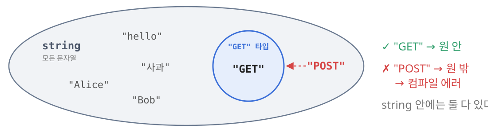
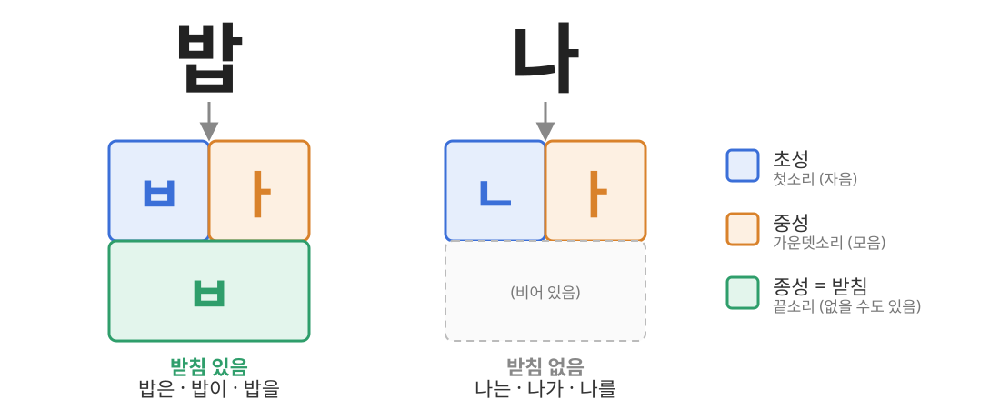
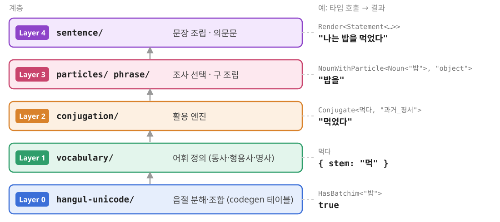

<!-- _class: lead -->
<!-- _paginate: false -->

# typed-korean

### 한국어 문법을 TypeScript 타입으로 모델링하기

<span class="small">타입 시스템 → 문법 규칙 → 모델링 → 불규칙 처리</span>

<!--
안녕하세요. 오늘은 한국어 문법 규칙을 TypeScript 타입 시스템만으로 표현해 본 typed-korean 프로젝트를 소개하려고 합니다.
런타임 코드는 한 줄도 없습니다. 모든 계산은 컴파일러가 타입을 검사하는 동안 일어납니다.
순서는 타입 시스템 소개, 다룰 문법 규칙, 그 규칙을 어떻게 타입으로 옮겼는지, 그리고 가장 까다로웠던 불규칙 활용 처리 순입니다. 마지막에 테스트 방법과 한계를 짧게 다루겠습니다.
-->

---

## 한 줄 요약: 문법이 틀리면 컴파일이 안 된다

```ts
const a: Conjugate<덥다, "해요체">   = "덥어요";
//    ^ error TS2322: Type '"덥어요"' is not assignable to type '"더워요"'.

const b: NounPhrase<"밥", "object"> = "밥를";
//    ^ error TS2322: Type '"밥를"' is not assignable to type '"밥을"'.

const c: Conjugate<모르다, "과거_평서"> = "몰랐다"; // OK
```

- 맞는 문장은 타입 체크를 통과하고, 틀린 문장은 컴파일 에러가 난다
- 영감: [typed-japanese](https://github.com/typedgrammar/typed-japanese)
- 목표는 실용 도구가 아니라 **"타입 시스템으로 어디까지 표현할 수 있나"** 실험

<!--
결과물부터 보여드리겠습니다.
"덥다"를 해요체로 활용한 타입에 "덥어요"를 넣으면 컴파일러가 거부하고, 정답이 "더워요"라고 알려줍니다. 에러 메시지가 그대로 문법 교정 역할을 합니다.
조사도 마찬가지입니다. "밥" 뒤의 목적격 조사는 "을"이어야 하니까 "밥를"은 에러입니다.
"모르다"의 과거형 "몰랐다"는 르 불규칙인데 통과합니다.
이 프로젝트는 일본어로 같은 실험을 한 typed-japanese에서 영감을 받았습니다. 실용 도구라기보다는 타입 시스템의 표현력을 시험해 보는 개념 실험입니다.
-->

---

<!-- _class: lead -->

# 1. 타입 시스템 소개

<!--
먼저 이걸 가능하게 하는 TypeScript 타입 시스템의 기능을 짚고 가겠습니다.
-->

---

## 먼저, 타입이란? — "들어갈 수 있는 값의 집합"

```ts
let name: string = "Alice";   // string = 모든 문자열의 집합
name = "Bob";                 // OK, "Bob"도 문자열

let method: "GET" = "GET";    // "GET" = 원소가 "GET" 하나뿐인 집합
method = "POST";
// ^ error: Type '"POST"' is not assignable to type '"GET"'.
```



- 컴파일러는 코드를 **실행하지 않고** "이 값이 이 집합에 들어가나?"만 검사

<!--
TypeScript를 처음 보시는 분도 계시니까 기초부터 가겠습니다. 이 섹션의 예시는 한국어와 상관없는 일반적인 예시로 준비했습니다. 문법 이야기는 다음 섹션에서 합니다.
TypeScript에서 타입은 그 자리에 들어갈 수 있는 값의 집합이라고 생각하면 됩니다.
위쪽의 string은 모든 문자열의 집합이라서 "Alice"를 넣든 "Bob"을 넣든 괜찮습니다.
아래쪽은 타입 자리에 "GET"이라는 문자열 자체를 썼습니다. 이걸 리터럴 타입이라고 하는데, 원소가 "GET" 하나뿐인 집합입니다. 그래서 "POST"를 넣으면 컴파일러가 에러를 냅니다.
중요한 점은 컴파일러가 이 코드를 실행하지 않는다는 겁니다. 값이 집합에 들어가는지만 검사합니다.
처음에 보여드린 "덥어요" 에러가 바로 이 검사입니다. "더워요"만 들어가는 타입을 계산해 낼 수 있다면, 나머지는 컴파일러가 알아서 막아 줍니다.
-->

---

## 타입에도 "함수"가 있다 — 제네릭

```ts
// 왼쪽: 값을 받는 함수 / 오른쪽: 타입을 받는 "함수"
function greet(name) {             type Greet<N extends string> =
  return `Hello, ${name}`;           `Hello, ${N}`;
}
greet("Alice"); // "Hello, Alice"
type R = Greet<"Alice">; // "Hello, Alice"
```

- `type 이름<매개변수>` = 함수 선언, `이름<인자>` = 함수 호출
- `N extends string` = "N에는 문자열 타입만 받는다" (매개변수의 타입 제한)
- `` `Hello, ${N}` `` = **템플릿 리터럴 타입**, 자바스크립트 템플릿 문자열과 같은 모양
- 결과는 에디터에서 마우스를 올리면 바로 보인다

<!--
그럼 타입을 어떻게 계산할까요? 타입에도 함수 같은 것이 있습니다. 제네릭 타입이라고 부릅니다.
왼쪽은 이름을 받아서 인사말을 만드는 평범한 자바스크립트 함수입니다. 오른쪽은 같은 일을 하는 타입입니다.
type Greet 다음 꺾쇠 괄호 안의 N이 매개변수이고, Greet에 "Alice"를 넣으면 호출입니다. extends string은 N에 문자열 타입만 받겠다는 제한입니다.
등호 오른쪽의 백틱 문법은 자바스크립트 템플릿 문자열과 똑같이 생겼습니다. 차이는 값이 아니라 타입을 이어 붙인다는 것뿐입니다. 그래서 결과는 "Hello, Alice"라는 리터럴 타입입니다.
이 결과는 에디터에서 R 위에 마우스를 올리면 바로 보입니다. 발표 중에 실제로 띄워서 보여드려도 좋습니다.
-->

---

## 분기: 조건부 타입 `A extends B ? X : Y`

```ts
// GET, HEAD는 안전한 메서드, 나머지는 아님
type IsSafe<M extends string> = M extends "GET" | "HEAD" ? "safe" : "unsafe";

type R1 = IsSafe<"GET">;   // "safe"
type R2 = IsSafe<"POST">;  // "unsafe"
```

동작 순서 (`IsSafe<"GET">`):
1. `M` 자리에 `"GET"`을 넣는다
2. `"GET"`은 집합 `"GET" | "HEAD"`에 들어가나? → **예**
3. `?` 뒤의 `"safe"`가 결과

- `extends ? :` = **삼항 연산자**로 읽으면 된다
- `"GET" | "HEAD"` (**유니온**) = "GET 또는 HEAD" = 원소가 둘인 집합

<!--
함수에는 if 문이 필요하죠. 타입에서는 조건부 타입이 그 역할을 합니다.
HTTP 메서드를 예로 들겠습니다. GET이나 HEAD면 "safe", 아니면 "unsafe"를 돌려주는 타입입니다.
읽는 법은 삼항 연산자와 같습니다. M이 "GET 또는 HEAD" 집합에 들어가면 물음표 뒤, 아니면 콜론 뒤가 결과입니다.
"GET"을 넣으면 그 집합에 들어가니까 "safe"가 나옵니다. "POST"를 넣으면 들어가지 않으니까 "unsafe"가 나옵니다.
세로 막대는 유니온이라고 부르는데 "또는"이라고 읽으면 됩니다. 앞에서 타입이 집합이라고 했으니, 원소가 둘인 집합입니다.
-->

---

## 패턴 매칭: `infer`로 문자열 쪼개기

```ts
// "/users/○○" 모양이면 ○○ 부분을 꺼낸다
type UserId<P extends string> =
  P extends `/users/${infer Id}` ? Id : never;

type R1 = UserId<"/users/42">;    // "42"
type R2 = UserId<"/users/alice">; // "alice"
type R3 = UserId<"/posts/7">;     // never  (패턴이 안 맞음)
```

동작 순서 (`UserId<"/users/42">`):
1. `"/users/42"`를 패턴 `` `/users/${Id}` ``에 맞춰 본다
2. 맞는다 → `Id = "42"`로 **추론(infer)**
3. 결과 `"42"`

- `never` = **빈 집합**. "결과 없음 / 실패"를 뜻한다

<!--
문자열을 다루려면 쪼갤 수도 있어야 합니다. 여기서 infer라는 키워드를 씁니다.
UserId는 "/users/무엇무엇" 모양의 경로에서 뒷부분을 꺼내는 타입입니다. 패턴 안에 infer Id라고 쓰면, 패턴이 맞을 때 그 자리에 들어간 부분을 Id라는 이름으로 잡아 줍니다. 정규식의 캡처 그룹과 비슷합니다.
"/users/42"를 넣으면 패턴에 맞고 Id는 "42"가 됩니다.
"/posts/7"은 "/users/"로 시작하지 않으니까 패턴이 안 맞고, 콜론 뒤의 never가 나옵니다. never는 빈 집합입니다. 어떤 값도 들어갈 수 없으니 "결과 없음", "실패"라는 뜻으로 씁니다. 잘못된 입력을 막을 때 이 never를 자주 쓰게 됩니다.
-->

---

## 표 조회: 객체 타입 + 인덱스 접근

```ts
type StatusText = {
  200: "OK";
  404: "Not Found";
  500: "Internal Server Error";
};

type R1 = StatusText[404];   // "Not Found"
type R2 = StatusText[418];
// ^ error: Property '418' does not exist on type 'StatusText'.
```

- 객체 타입 = **룩업 테이블**, `T[키]` = 조회
- 없는 키를 조회하면 컴파일 에러 → 빠진 항목을 컴파일러가 잡아 준다
- 긴 `if` / `else` 사슬 대신 **표 한 장**으로 규칙을 적을 수 있다

<!--
다음은 표 조회입니다. 객체 타입을 정의하고 대괄호로 키를 넣으면 그 키의 타입을 꺼낼 수 있습니다. 자바스크립트 객체에서 값을 꺼내는 것과 같은 모양입니다.
HTTP 상태 코드를 예로 들면, 404를 조회하면 "Not Found"가 나옵니다.
표에 없는 418을 조회하면 컴파일 에러가 납니다. 항목을 빠뜨리면 바로 알 수 있다는 뜻입니다.
조건문을 길게 이어 쓰는 것보다 표가 읽기도 쉽고 고치기도 쉽습니다. 이 프로젝트가 문법 규칙을 담는 기본 방식이 이 표입니다.
-->

---

## 표 전체 돌기: 매핑된 타입

```ts
type Methods = { GET: "safe"; POST: "unsafe"; HEAD: "safe"; DELETE: "unsafe" };

// ① 각 키를 돌면서, 안전하면 자기 이름, 아니면 never
type Step1 = { [K in keyof Methods]: Methods[K] extends "safe" ? K : never };
//   = { GET: "GET"; POST: never; HEAD: "HEAD"; DELETE: never }

// ② 값만 모은다 (never는 빈 집합이라 사라짐)
type SafeMethods = Step1[keyof Methods];
//   = "GET" | never | "HEAD" | never  =  "GET" | "HEAD"
```

- `keyof T` = 키 목록 (`"GET" | "POST" | "HEAD" | "DELETE"`)
- `{ [K in ...]: ... }` = 키마다 반복 (자바스크립트의 `map`)
- ①+② = **표에서 조건에 맞는 키만 골라내는** 관용구 (`filter`)

<!--
표를 한 칸씩이 아니라 전체를 훑어야 할 때도 있습니다. 이때 매핑된 타입을 씁니다.
예를 들어 메서드 표에서 안전한 메서드만 골라내고 싶다고 하겠습니다.
첫 단계에서 keyof로 키 목록을 얻고, 대괄호 안의 K in 문법으로 키마다 반복합니다. 자바스크립트의 map과 같습니다. 안전하면 자기 이름을, 아니면 never를 넣습니다.
두 번째 단계에서 값만 모으면 "GET 또는 never 또는 HEAD 또는 never"가 되는데, never는 빈 집합이라 합집합에서 사라집니다. 결과는 "GET 또는 HEAD"입니다.
이 두 단계가 표에서 조건에 맞는 키만 골라내는 관용구입니다. filter라고 생각하시면 됩니다.
-->

---

## 유니온을 넣으면 각각 계산된다

```ts
type R1 = Greet<"Alice" | "Bob">;      // "Hello, Alice" | "Hello, Bob"
type R2 = IsSafe<"GET" | "POST">;      // "safe" | "unsafe"
type R3 = `${"small" | "large"}-${"red" | "blue"}`;
//   = "small-red" | "small-blue" | "large-red" | "large-blue"
```

```
IsSafe<"GET" | "POST">
  → IsSafe<"GET"> | IsSafe<"POST">     (원소마다 따로 호출)
  → "safe"        | "unsafe"
```

- 조건부 타입과 템플릿 리터럴은 유니온의 **원소마다 따로** 계산된다 (분배)
- 입력 여러 개를 한 번에 넣어 **가능한 결과를 모두** 얻을 수 있다

<!--
타입 시스템의 독특한 성질이 하나 있습니다. 유니온을 넣으면 원소마다 따로 계산해서 결과를 다시 유니온으로 모아 줍니다. 분배라고 부릅니다.
IsSafe에 GET 또는 POST를 넣으면, IsSafe GET과 IsSafe POST를 따로 계산해서 "safe 또는 unsafe"가 나옵니다.
템플릿 리터럴에 유니온을 두 개 넣으면 가능한 조합이 전부 나옵니다. 크기 두 개, 색 두 개라서 네 가지입니다.
뒤에서 의문사 여러 개로 질문을 한꺼번에 만드는 예시가 이 성질을 이용합니다.
-->

---

## 반복: 재귀 타입

```ts
// 단어 배열을 공백으로 이어 붙인다
type Words<P extends string[], Acc extends string = ""> =
  P extends [infer Head extends string, ...infer Rest extends string[]]
    ? Words<Rest, Acc extends "" ? Head : `${Acc} ${Head}`>  // 자기 자신 호출
    : Acc;                                                   // 다 쓰면 종료

type R = Words<["TypeScript", "is", "fun"]>; // "TypeScript is fun"
```

```
Words<["TypeScript","is","fun"], "">
→ Words<["is","fun"], "TypeScript">
→ Words<["fun"], "TypeScript is">
→ Words<[], "TypeScript is fun">   → 패턴 실패 → "TypeScript is fun"
```

- 반복문이 없으니 **자기 자신을 다시 호출**해서 반복
- 컴파일러는 재귀 깊이에 한계가 있다 → 나중에 성능 이야기와 연결

<!--
마지막으로 반복입니다. 타입에는 for 문이 없어서 자기 자신을 다시 호출하는 재귀로 반복합니다.
Words는 단어 배열을 받아서 공백으로 이어 붙입니다. 배열을 첫 원소와 나머지로 쪼개고, 첫 원소를 누적값에 붙인 다음 나머지로 다시 자기 자신을 호출합니다.
아래 실행 과정을 보시면 한 단계씩 배열이 줄어들고 누적값이 늘어납니다. 배열이 비면 패턴이 맞지 않으니까 누적값을 돌려주고 끝납니다.
다만 컴파일러는 재귀 깊이에 한계가 있어서, 무작정 재귀를 쓰면 느려지거나 에러가 납니다. 이 점은 뒤에서 설계 결정의 이유로 다시 나옵니다.
-->

---

## 정리: 타입 문법 치트시트

| 타입 문법 | 읽는 법 | 자바스크립트 대응 |
| --- | --- | --- |
| `"GET"` | 정확히 이 문자열 | 값 `"GET"` |
| `"GET" \| "HEAD"` | GET 또는 HEAD | — |
| `never` | 빈 집합, 실패 | `undefined` 반환 비슷 |
| `type F<X> = ...` / `F<"Alice">` | 함수 선언 / 호출 | `function f(x)` / `f("Alice")` |
| `` `Hello, ${N}` `` | 문자열 이어 붙이기 | `` `Hello, ${n}` `` |
| `A extends B ? X : Y` | A가 B에 속하면 X | `cond ? x : y` |
| `` P extends `/users/${infer Id}` `` | 패턴 매칭으로 꺼내기 | 정규식 캡처 |
| `T[404]` | 표 조회 | `obj[404]` |
| `{ [K in keyof T]: ... }` | 키마다 반복 | `Object.keys(t).map(...)` |

→ 사실상 **문자열을 다루는 작은 함수형 언어**. 이 문법만으로 이후 내용을 모두 읽을 수 있다

<!--
지금까지 본 문법을 한 장으로 정리했습니다. 이후 슬라이드에 나오는 코드는 전부 이 문법의 조합입니다. 코드가 낯설게 느껴지시면 이 표를 떠올려 주세요.
정리하면 TypeScript 타입 시스템은 문자열을 다루는 작은 함수형 언어입니다. 함수가 있고, 분기가 있고, 표 조회가 있고, 재귀로 반복할 수 있습니다.
이제 이 언어로 무엇을 표현할지, 한국어 문법 규칙을 보겠습니다.
-->

---

<!-- _class: lead -->

# 2. 문법 규칙

<!--
다음은 이번에 다룬 한국어 문법 규칙입니다. 한국어 화자에게는 당연하지만, 코드로 옮기려면 명시적으로 적어야 하는 규칙들입니다.
-->

---

## 한글 한 글자는 세 조각으로 이루어진다



<!--
본격적인 규칙에 앞서 한글 음절 구조를 짚고 가겠습니다.
한글 한 글자는 초성, 중성, 종성 세 조각으로 이루어집니다. 초성은 첫소리 자음, 중성은 가운데 모음, 종성은 끝소리 자음이고, 이 종성을 흔히 받침이라고 부릅니다.
"밥"은 ㅂ, ㅏ, ㅂ으로 세 칸이 다 차 있습니다. "나"는 ㄴ과 ㅏ만 있고 받침 칸이 비어 있습니다.
이 받침 칸이 차 있느냐 비어 있느냐에 따라 뒤에 붙는 조사가 달라집니다. "밥은, 밥이, 밥을", "나는, 나가, 나를"처럼요.
그리고 컴퓨터 입장에서 중요한 점은, 이 세 조각이 유니코드에서는 한 글자로 합쳐져 있다는 겁니다. 그래서 받침이 있는지 알려면 글자를 다시 쪼개야 합니다. 이걸 타입으로 어떻게 했는지는 모델링 섹션에서 보여드리겠습니다.
-->

---

## 규칙 ①: 받침이 조사를 고른다

- **받침 유무**가 조사와 어미의 형태를 결정한다

| 역할 | 받침 O | 받침 X | 예 |
| --- | --- | --- | --- |
| 주제 | 은 | 는 | 밥은 / 사과는 |
| 주격 | 이 | 가 | 밥이 / 사과가 |
| 목적격 | 을 | 를 | 밥을 / 사과를 |
| 도구·방향 | 으로 (ㄹ받침은 로) | 로 | 부산으로 / 서울로 / 제주로 |

<!--
첫 번째 규칙은 방금 본 받침입니다. 받침이 있느냐 없느냐가 아주 많은 것을 결정하는데, 조사가 대표적입니다. 은/는, 이/가, 을/를 모두 받침 유무에 따라 둘 중 하나를 고릅니다.
으로/로는 예외가 하나 있습니다. ㄹ 받침 뒤에서는 받침이 있어도 "로"를 씁니다. "서울로"가 맞고 "서울으로"는 틀립니다.
-->

---

## 규칙 ②: 모음조화와 모음 축약

**모음조화**: 어간 마지막 모음이 양성(ㅏ ㅗ ㅑ ㅛ)이면 `아`, 아니면 `어`
- 잡 → 잡**아**요, 먹 → 먹**어**요

**모음 축약**: 받침 없는 어간 + 아/어 → 한 음절로 합쳐짐

| 어간 모음 + 어미 모음 | 결과 | 예 |
| --- | --- | --- |
| ㅏ + ㅏ | ㅏ | 가 + 아 → 가 |
| ㅗ + ㅏ | ㅘ | 오 + 아 → 와 |
| ㅜ + ㅓ | ㅝ | 주 + 어 → 줘 |
| ㅡ + ㅓ | ㅓ | 쓰 + 어 → 써 |
| ㅣ + ㅓ | ㅕ | 마시 + 어 → 마셔 |
| ㅚ + ㅓ | ㅙ | 되 + 어 → 돼 |

<!--
두 번째는 모음조화와 모음 축약입니다.
어간의 마지막 모음이 ㅏ나 ㅗ 같은 양성 모음이면 "아", 그 외에는 "어"를 붙입니다. "잡아요", "먹어요"가 그 예입니다.
그런데 어간에 받침이 없으면 모음끼리 만나서 합쳐집니다. "가"에 "아"가 붙으면 "가아"가 아니라 "가", "오"에 "아"가 붙으면 "와"가 됩니다.
여기서 "쓰다"가 "써요"가 되는 ㅡ 탈락은 어간 모양이 바뀌어서 불규칙처럼 보이지만, 이 표의 한 줄로 처리할 수 있었습니다. 뒤에서 다시 다루겠습니다.
-->

---

## 규칙 ③: 어미는 자음으로 시작하거나 모음으로 시작한다

| 어미 | 시작 | 먹다 | 가다 |
| --- | --- | --- | --- |
| 해요체 `-아/어요` | 모음 | 먹어요 | 가요 |
| 과거 `-았/었다` | 모음 | 먹었다 | 갔다 |
| 연결 `-아/어서` | 모음 | 먹어서 | 가서 |
| 합쇼체 `-(스)ㅂ니다` | 자음 | 먹습니다 | 갑니다 |
| 평서 `-(느)ㄴ다` | 자음 | 먹는다 | 간다 |
| 연결 `-고` / `-지만` | 자음 | 먹고 / 먹지만 | 가고 / 가지만 |
| 조건 `-(으)면` | 자음* | 먹으면 | 가면 |

- 이 구분이 **불규칙 활용의 스위치**가 된다

<!--
세 번째는 어미의 분류입니다. 이번에 지원한 어미 8종을 보면 모음으로 시작하는 어미와 자음으로 시작하는 어미로 나뉩니다.
이 구분이 중요한 이유는 불규칙 동사가 대부분 모음 어미 앞에서만 모양이 바뀌기 때문입니다. "덥다"는 "덥고"에서는 그대로지만 "더워요"에서는 바뀝니다.
"-(으)면"에 별표를 친 이유는, 자음 어미지만 받침 뒤에 "으"가 끼어들면서 모음 어미처럼 행동하기 때문입니다. 이 경계 사례도 뒤에서 다시 나옵니다.
-->

---

<!-- _class: lead -->

# 3. 모델링

<!--
이제 이 규칙들을 실제로 어떻게 타입으로 옮겼는지 보겠습니다.
-->

---

## 전체 구조: 5개 계층



- 아래 계층은 위 계층을 모른다
- 각 계층의 출력은 **문자열 리터럴 타입** → 다음 계층의 입력

<!--
전체는 다섯 계층입니다. 맨 아래 Layer 0은 한글 음절을 분해하고 조합합니다. 그 위에 어휘 정의, 활용 엔진, 조사 선택, 문장 조립이 차례로 올라갑니다.
계층 사이의 인터페이스는 단순합니다. 오른쪽 열을 보시면 각 계층의 결과가 true, "먹었다", "밥을" 같은 리터럴 타입입니다. 이 결과가 위 계층의 입력이 되고, 맨 위에서 "나는 밥을 먹었다"라는 문장이 나옵니다.
아래에서부터 하나씩 보겠습니다.
-->

---

## 넘어야 할 벽: 타입 시스템은 산술을 못 한다

한글 음절은 유니코드 **공식으로 계산**된다 → 타입 수준에서는 산술이 불가능
해결: **코드 생성(codegen)으로 표를 미리 만들고, 타입은 조회만** 한다


<!--
Layer 0을 보기 전에, 구현하면서 처음 부딪힌 벽부터 말씀드리겠습니다. 앞에서 한글 한 글자가 초성, 중성, 종성으로 이루어진다고 했는데, 유니코드에서는 이 세 조각이 공식으로 계산되어 한 글자가 됩니다. 초성, 중성, 종성 번호를 곱하고 더해서 코드포인트를 구합니다.
1장에서 본 타입 문법을 떠올려 보시면, 문자열을 붙이고 쪼개고 조회하는 기능은 있었지만 숫자를 곱하고 더하는 기능은 없었습니다. 타입 시스템은 이런 산술을 할 수 없고, 문자를 코드포인트로 바꾸는 기능도 없습니다.
그래서 계산을 조회로 바꿨습니다. 스크립트로 룩업 테이블을 미리 생성해서 커밋해 둡니다. 분해 테이블은 자모마다 그 자모를 포함한 음절 목록을 담고 있고, 조합 테이블은 "ㄱ_ㅏ_ㅂ" 같은 키로 "갑"을 찾습니다.
이 프로젝트 전체에서 반복되는 패턴인데, 계산하기 어려운 것은 데이터로 만들어서 조회합니다.
-->

---

## Layer 0: 테이블 역방향 검색으로 음절 분해

```ts
// 생성된 테이블 (일부)
type ChoTable = { "ㄱ": "가각갂갃간…"; "ㄴ": "나낙낚…"; … };
type JongTable = { "NULL": "가개갸…"; "ㄱ": "각객갹…"; … };

// "이 글자를 포함한 키는?" → 매핑된 타입으로 검색
type FindContainingKey<T, C extends string> = {
  [K in keyof T]: T[K] extends `${string}${C}${string}` ? K : never;
}[keyof T];

type DecomposeLastChar<"먹">; // { 초: "ㅁ"; 중: "ㅓ"; 종: "ㄱ" }
type HasBatchim<"사과">;      // false
type Compose<"ㅂ", "ㅘ", "ㅆ">; // "봤"  ← ComposeTable["ㅂ_ㅘ_ㅆ"]
```

참고: https://hackers.pub/@joonnot/2026/typed-korean-jamo-table-inversion

<!--
Layer 0입니다. 생성된 테이블은 자모를 키로, 그 자모를 포함하는 음절 전체를 하나의 긴 문자열 값으로 가집니다.
글자를 분해할 때는 이 테이블을 거꾸로 검색합니다. 1장에서 본 filter 관용구로 모든 키를 순회하면서, 값 문자열에 그 글자가 들어 있는 키만 남깁니다. 패턴 매칭의 앞뒤를 아무 문자열이나 허용하도록 열어 두면 "포함하는가" 검사가 됩니다. 초성 테이블, 중성 테이블, 종성 테이블에 각각 물어보면 "먹"이 ㅁ, ㅓ, ㄱ으로 분해됩니다.
조합은 더 쉽습니다. "ㅂ_ㅘ_ㅆ"라는 키로 조합 테이블을 조회하면 "봤"이 나옵니다.
참고로 분해 테이블은 음절 하나하나를 유니온으로 나열하지 않고 자모별 긴 문자열 하나로 만들어서 11,172자 전체를 담습니다. 조합 테이블은 받침을 엔진이 실제로 끼워 넣는 ㄴ, ㄹ, ㅂ, ㅆ과 받침 없음으로만 제한해서 1,995개 항목입니다.
테이블을 생성하고 압축한 과정은 블로그 글로 자세히 정리해 두었으니, 관심 있으신 분은 슬라이드 아래 링크를 참고해 주세요.
-->

---

## Layer 0: 넓은 `string`은 막는다

```ts
type IfLiteral<S extends string, Then, Else> =
  string extends S ? Else : Then;

type HasBatchim<string>; // never
```

- `string`이 들어오면 "어떤 문자열이든"이라는 뜻 → 받침을 판단할 수 없음
- 리터럴이 아닌 입력은 **`never`로 전파**해서 잘못된 결과 대신 에러를 유도
- 공개 API 경계에서만 검사, 내부 헬퍼는 리터럴을 가정

```ts
string extends "밥"  // false: 모든 문자열이 "밥"은 아니다 → 리터럴
string extends string // true:  넓은 string → 막는다
```

<!--
작지만 중요한 장치가 하나 있습니다. 누군가 리터럴 대신 그냥 string을 넣으면 받침이 있는지 판단할 수 없습니다. 그런데 조건부 타입은 이런 경우에 엉뚱한 결과를 낼 수 있습니다.
그래서 IfLiteral이라는 관문을 두었습니다. string이 리터럴 타입의 상위 집합인지를 검사하는 관용구인데, 넓은 string이 들어오면 never를 돌려줍니다. never는 위 계층으로 그대로 전파되기 때문에, 틀린 답 대신 에러가 납니다.
-->

---

## Layer 1: 어휘 = 어간 + 속성 태그

```ts
interface Verb { stem: string; ending: "다"; }
interface RegularVerb extends Verb { irregularType?: never; }
interface Adjective extends Verb { partOfSpeech: "adjective"; }
interface Noun<W extends string = string> { word: W; }

type 먹다   = RegularVerb & { stem: "먹" };
type 크다   = Adjective & RegularVerb & { stem: "크" };
type 공부하다 = 하다Verb & { prefix: "공부" };
```

- 동사·형용사는 **어간**만 저장, "다"는 고정
- 명사는 받침 정보를 저장하지 않음 → 필요할 때 `HasBatchim`으로 계산
- 속성은 교차 타입(`&`)으로 조합
  - `A & B` = **A이면서 B** (두 집합의 교집합) → 필드가 합쳐진 객체

<!--
Layer 1은 어휘입니다. 동사는 어간과 "다"로 이루어집니다. 어간이 실제 데이터이고, "다"는 사전형 표시라서 고정입니다.
형용사는 동사와 거의 똑같이 활용되기 때문에 Verb를 확장하고, 품사 태그만 하나 붙였습니다. 이 태그는 "먹는다"와 "덥다"처럼 평서 현재형이 다른 곳에서만 쓰입니다.
명사는 단어만 저장합니다. 받침 여부를 필드로 두면 실수로 틀린 값을 넣을 수 있으니, 필요할 때마다 계산합니다.
속성은 교차 타입으로 조합합니다. 앰퍼샌드는 앞에서 본 유니온의 반대인 교집합입니다. 객체 타입끼리 교집합을 하면 양쪽 필드를 모두 가진 객체가 됩니다. "크다"는 형용사이면서 규칙 활용이고 어간이 "크"인 타입입니다.
-->

---

## Layer 2: 어미 규칙도 데이터로

```ts
type EndingRuleMap = {
  해요체:   { start: "vowel";     connective: false };
  과거_평서: { start: "vowel";     connective: false };
  합쇼체:   { start: "consonant"; connective: false };
  고:      { start: "consonant"; connective: true  };
  아서:    { start: "vowel";     connective: true  };
  면:      { start: "consonant"; connective: true  };
  // …
};
type EndingType = keyof EndingRuleMap;

// 분류는 테이블에서 파생 → 어미를 추가해도 자동으로 동기화
type ConnectiveEnding = {
  [K in EndingType]: EndingRuleMap[K]["connective"] extends true ? K : never;
}[EndingType]; // "고" | "아서" | "면" | "지만"
```

<!--
Layer 2는 활용 엔진입니다. 먼저 어미 정보를 테이블로 만들었습니다. 각 어미가 모음으로 시작하는지, 절을 잇는 연결 어미인지를 적어 둡니다.
"모음 어미 목록", "연결 어미 목록" 같은 분류는 직접 나열하지 않고 이 테이블에서 파생시킵니다. 1장에서 안전한 HTTP 메서드만 골라냈던 filter 관용구와 똑같은 모양입니다. 그래서 어미를 하나 추가할 때 테이블 한 줄만 고치면 모든 분류가 따라옵니다.
연결 어미 목록은 나중에 ConnectiveVerbPhrase가 "고, 아서, 면, 지만"만 받도록 제한하는 데 쓰입니다.
-->

---

## Layer 2: 모음 축약 = 테이블 조회 + 재조합

```ts
type ContractionTable = {
  ㅏ_ㅏ: "ㅏ"; ㅗ_ㅏ: "ㅘ"; ㅜ_ㅓ: "ㅝ"; ㅡ_ㅓ: "ㅓ";
  ㅣ_ㅓ: "ㅕ"; ㅕ_ㅓ: "ㅕ"; ㅐ_ㅓ: "ㅐ"; ㅔ_ㅓ: "ㅔ"; ㅚ_ㅓ: "ㅙ";
};

type Contract<StemV, EndV> =
  `${StemV}_${EndV}` extends keyof ContractionTable
    ? ContractionTable[`${StemV}_${EndV}`]
    : null; // 축약 없음 → 그냥 이어 붙임
```

```
"보" + 과거  →  분해 {초:ㅂ, 중:ㅗ}  →  Contract<ㅗ,ㅏ> = ㅘ
            →  Compose<ㅂ, ㅘ, ㅆ> = "봤"  →  "봤다"
```

<!--
모음 축약도 같은 방식입니다. 어간 모음과 어미 모음을 밑줄로 이은 키로 표를 조회합니다. 키가 없으면 축약하지 않고 그냥 이어 붙입니다.
"보다"의 과거형을 예로 들면, "보"를 분해해서 초성 ㅂ과 중성 ㅗ를 얻고, ㅗ와 ㅏ의 축약 결과인 ㅘ를 찾고, 과거형이니까 종성에 ㅆ을 넣어서 다시 조합합니다. 그러면 "봤"이 되고 "다"를 붙이면 "봤다"입니다.
분해, 조회, 조합. 이 세 단계가 활용 엔진의 기본 동작입니다.
-->

---

## Layer 2: `Conjugate` — 어간을 고르고, 표에서 꺼낸다

```ts
type ConjugationMap<V extends Verb, S extends string> = {
  해요체:   `${ClassVowelBase<V, S, "present">}요`;
  과거_평서: `${ClassVowelBase<V, S, "past">}다`;
  합쇼체:   PoliteFormal<S>;  // 먹습니다 / 갑니다 / 삽니다(ㄹ탈락)
  평서_현재: V extends Adjective ? `${V["stem"]}다` : PlainPresent<S>;
  고:      `${S}고`;
  // …
};

type Conjugate<V extends Verb, F extends EndingType> =
  EffectiveStem<V, F> extends infer S extends string   // ① 실효 어간 1회 계산 (결과에 S라는 이름을 붙임)
    ? ConjugationMap<V, S>[F]                          // ② 어미로 인덱싱
    : never;
```

- 깊은 조건 분기 대신 **객체 하나 + 인덱스 접근**
- 컴파일러의 분기 깊이를 얕게 유지 → 성능과 가독성

<!--
활용 엔진의 진입점인 Conjugate입니다. 두 단계로 동작합니다.
먼저 실효 어간, 즉 이 어미 앞에서 실제로 쓸 어간을 한 번만 계산해서 infer로 S에 담습니다. 불규칙 동사에서 이 부분이 중요한데, 바로 다음 섹션에서 설명합니다.
그다음 어미별 결과를 모아 둔 객체 타입을 만들고, 어미 이름으로 인덱싱합니다.
처음에는 "해요체면 이렇게, 아니면 과거면 이렇게" 하는 조건문 사슬로 짰는데, 어미가 늘어날수록 깊어지고 읽기 어려웠습니다. 객체 하나로 바꾸니 새 어미를 추가할 때 한 줄만 쓰면 되고, 컴파일러가 따라가야 할 분기도 얕아졌습니다.
-->

---

## Layer 3–4: 조사 선택과 문장 조립

```ts
interface AlternatingParticleMap {
  topic: ["은", "는"]; subject: ["이", "가"]; object: ["을", "를"]; with: ["과", "와"];
}
type SelectAlternating<W, R> =
  HasBatchim<W> extends true ? AlternatingParticleMap[R][0] : AlternatingParticleMap[R][1];

type 나는_밥을_먹었다 = Render<Statement<
  NounWithParticle<Noun<"나">, "topic">,    // "나는"
  NounWithParticle<Noun<"밥">, "object">,   // "밥을"
  VerbPhrase<먹다, "과거_평서">              // "먹었다"
>>; // "나는 밥을 먹었다"
```

- 조사: `[받침O, 받침X]` 튜플 + 받침 분기 **한 곳**
- 문장: 역할 슬롯(`subject`, `object`, `time`, …)을 보존한 구조체 → 정해진 어순으로 렌더링

<!--
조사는 역할별로 받침 있을 때와 없을 때의 형태를 튜플로 저장했습니다. 받침 분기는 SelectAlternating 한 곳에만 있고, 은는, 이가 같은 헬퍼는 모두 이걸 호출합니다. 으로/로의 ㄹ 예외는 별도 규칙으로 처리했습니다.
문장은 명사구와 동사구를 조립해서 만듭니다. 여기서 문장을 바로 문자열로 합치지 않고, 주어, 목적어, 서술어 같은 역할 슬롯을 가진 구조체로 유지한 다음 마지막에 렌더링합니다.
-->

---

## 구조를 보존하면 문법 검사가 가능해진다


```ts
WhQuestion<"누가" | "언제" | "왜", { locFrom: "서울에서"; predicate: "먹어요" }>;
// "누가 서울에서 먹어요?" | "언제 서울에서 먹어요?" | "서울에서 왜 먹어요?"  ← 유니온이면 전부 생성
```

<!--
구조체로 유지한 이유가 이 슬라이드입니다. 의문문을 만들 때 의문사마다 차지하는 슬롯이 정해져 있습니다. "언제"는 시간 슬롯, "누가"는 주어 슬롯입니다.
"어제 왔어요"에 "언제"를 넣으면 "어제 언제 왔어요?"라는 이상한 문장이 되는데, 시간 슬롯이 이미 채워져 있으니 충돌 에러를 돌려줍니다. 문자열로 합쳐 버렸다면 이런 검사는 불가능했을 겁니다.
그리고 유니온 분배 덕분에 의문사 여러 개를 넣으면 가능한 질문이 한꺼번에 나옵니다.
-->

---

<!-- _class: lead -->

# 4. 불규칙 처리

<!--
이제 가장 까다로웠던 불규칙 활용입니다.
-->

---

## 한국어 불규칙 활용

| 유형 | 변화 | 예 (모음 어미 앞) | 자음 어미 앞 |
| --- | --- | --- | --- |
| ㅂ | ㅂ → 우 | 덥다 → 더워요 | 덥고 |
| ㄷ | ㄷ → ㄹ | 듣다 → 들어요 | 듣고 |
| ㅅ | ㅅ 탈락, 축약 안 함 | 짓다 → 지어요 | 짓고 |
| ㅎ | ㅎ 탈락 + 모음 변화 | 그렇다 → 그래요 | 그렇고 |
| 르 | 르 → ㄹ라/ㄹ러 | 모르다 → 몰라요 | 모르고 |
| 러 | 어 → 러 | 이르다 → 이르러요 | 이르고 |
| 하다 | 하 + 여 → 해 | 공부하다 → 공부해요 | 공부하고 |

- 공통점: **모음 어미 앞에서만** 어간이 바뀐다

<!--
지원하는 불규칙 유형은 이렇습니다. ㅂ, ㄷ, ㅅ, ㅎ, 르, 러 불규칙과 하다 활용입니다.
표를 보면 공통점이 있습니다. 오른쪽 열, 자음 어미 앞에서는 전부 어간이 그대로입니다. 바뀌는 건 모음 어미 앞뿐입니다.
이 관찰이 설계의 출발점이었습니다.
-->

---

## 핵심 설계: 변화를 "계산"하지 말고 "저장"한다

```ts
interface IrregularVerb<Type extends IrregularType, Alt extends string = string>
  extends Verb {
  irregularType: Type;
  altStem: Alt;          // 모음 어미 앞에서 쓸 어간
}

type 덥다   = Adjective & IrregularVerb<"ㅂ", "더우"> & { stem: "덥" };
type 듣다   = IrregularVerb<"ㄷ", "들"> & { stem: "듣" };
type 모르다 = IrregularVerb<"르", "몰"> & { stem: "모르" };
type 그렇다 = Adjective & IrregularVerb<"ㅎ", "그래"> & { stem: "그렇" };
```

- ㅂ→우, ㄷ→ㄹ 변환을 엔진이 계산하지 않는다
- **어휘 정의에 대체 어간을 적어 둠** → 엔진은 "어느 어간을 쓸지"만 결정

<!--
가장 중요한 설계 결정입니다. 불규칙 변화를 엔진에서 계산하지 않고, 어휘를 정의할 때 대체 어간을 직접 적어 둡니다.
"덥다"는 기본 어간 "덥"과 대체 어간 "더우"를 가집니다. "듣다"는 "듣"과 "들"입니다.
ㅂ을 빼고 우를 넣는 변환을 타입으로 구현하는 것도 가능은 합니다. 하지만 유형마다 분해, 조합 로직을 따로 짜야 하고 복잡도가 엔진 전체로 퍼집니다.
대신 어휘에 데이터를 하나 더 적으면, 엔진의 질문은 "어떻게 변환하나"에서 "둘 중 어느 어간을 쓰나"로 단순해집니다. 앞에서 본 "계산 대신 조회" 원칙을 불규칙에도 적용한 것입니다.
-->

---

## `EffectiveStem`: 어미 테이블이 스위치

```ts
type EffectiveStem<V extends Verb, F extends EndingType> =
  EndingRuleMap[F]["start"] extends "vowel"
    ? V extends IrregularVerb<IrregularType> ? V["altStem"] : V["stem"]
    : V["stem"];
```


- 대체 어간이 나온 다음은 **규칙 동사와 같은 파이프라인**을 탄다
- 듣다도 같은 갈림길: `"들"` + 어요 → 들어요. ㅂ·ㄷ 불규칙은 이것만으로 끝

<!--
어느 어간을 쓸지는 앞에서 본 어미 테이블이 결정합니다. 모음으로 시작하는 어미이고 불규칙 동사이면 대체 어간을, 그 외에는 기본 어간을 씁니다.
"덥다"의 해요체는 대체 어간 "더우"가 선택되고, 그다음은 일반 모음 축약 규칙이 ㅜ와 ㅓ를 ㅝ로 합쳐서 "더워요"를 만듭니다. "듣다"는 "들"이 선택되고, 받침이 있으니 "어"를 붙여서 "들어요"입니다.
대체 어간이 선택된 다음에는 규칙 동사와 똑같은 파이프라인을 탑니다. ㅂ, ㄷ 불규칙은 이것만으로 처리가 끝납니다.
-->

---

## 따라가 보기: `Conjugate<덥다, "해요체">`

| 단계 | 호출 | 결과 |
| --- | --- | --- |
| 1. 동사 부류 | `VerbClass<덥다>` | `"default"` (하다·르·러 아님) |
| 2. 어미 정보 | `EndingRuleMap["해요체"]["start"]` | `"vowel"` |
| 3. 어간 선택 | `EffectiveStem<덥다, "해요체">` | 모음 어미 + 불규칙 → `"더우"` |
| 4. 표에서 꺼내기 | `ConjugationMap<덥다, "더우">["해요체"]` | `` `${PresentVowelBase<…>}요` `` |
| 5. 분해 | `DecomposeLastChar<"더우">` | `{ 초: "ㅇ"; 중: "ㅜ"; 종: null }` |
| 6. 모음조화 | `ㅜ`는 양성 모음? | 아니오 → `"ㅓ"` |
| 7. 축약 | `ContractionTable["ㅜ_ㅓ"]` | `"ㅝ"` |
| 8. 조합 | `"더"` + `Compose<"ㅇ", "ㅝ", null>` | `"더워"` |
| 9. 어미 붙이기 | `` `${"더워"}요` `` | **`"더워요"`** |

- 불규칙이 관여하는 건 **3단계 한 곳**, 나머지는 규칙 동사 `주다 → 줘요`와 같은 경로

<!--
실제로 컴파일러가 어떤 순서로 계산하는지 처음부터 끝까지 따라가 보겠습니다. "덥다"를 해요체로 활용하는 경우입니다.
먼저 동사 부류를 판정합니다. 하다, 르, 러가 아니니까 기본 경로입니다.
어미 표에서 해요체가 모음으로 시작한다는 걸 확인하고, 불규칙 동사니까 대체 어간 "더우"를 고릅니다.
그다음 어미별 표에서 해요체 칸을 꺼냅니다. 여기부터는 규칙 동사와 똑같습니다.
"더우"의 마지막 글자 "우"를 분해하면 ㅇ, ㅜ, 받침 없음입니다. ㅜ는 양성 모음이 아니니까 "어" 계열이고, 축약 표에서 ㅜ와 ㅓ를 찾으면 ㅝ입니다. ㅇ과 ㅝ를 조합하면 "워", 앞의 "더"와 합쳐서 "더워", 마지막에 "요"를 붙이면 "더워요"입니다.
표를 보시면 불규칙이 관여하는 건 3단계 한 곳뿐입니다. 4단계부터는 규칙 동사 "주다"가 "줘요"가 되는 경로와 완전히 같습니다. 대체 어간을 저장해 둔 설계 덕분입니다.
-->

---

## 그래도 남는 예외들: 필요한 곳에만 분기

| 유형 | 남은 문제 | 처리 |
| --- | --- | --- |
| ㅅ | `지 + 어`인데 ㅣ+ㅓ=ㅕ 축약이 일어나면 안 됨 ("져요" ✗) | 축약 건너뛰기 분기 |
| 르 | 모음조화를 `몰`이 아니라 원래 어간 `모르`의 **앞 음절**로 판단 | `르아어Vowel` + 전용 vowel base |
| 러 | 항상 `러` | 전용 vowel base |
| ㅎ | `-(으)면`에서 대체 어간이 아닌 `그러면` | `DropFinalJong` |
| 하다 | 접두 명사를 다시 붙여야 함 | 전용 테이블 `하다ConjugationMap` |

```ts
type VerbClass<V> = V extends 하다Verb ? "하다"
  : V extends IrregularVerb<"르"> ? "르"
  : V extends IrregularVerb<"러"> ? "러" : "default";
```

<!--
물론 대체 어간만으로 모든 게 해결되지는 않았습니다.
ㅅ 불규칙은 "짓다"의 대체 어간이 "지"인데, 그냥 두면 ㅣ와 ㅓ가 축약돼서 "져요"가 됩니다. 실제로는 "지어요"죠. ㅅ이 탈락한 흔적 때문에 축약이 일어나지 않습니다. 그래서 축약을 건너뛰는 분기를 넣었습니다.
르 불규칙은 "몰라요"인지 "몰러요"인지를 대체 어간 "몰"이 아니라 원래 어간 "모르"의 앞 음절 모음으로 판단해야 합니다. 그래서 전용 모음조화 함수가 있습니다.
ㅎ 불규칙은 조건형에서 "그래면"이 아니라 "그러면"이 되기 때문에 받침만 떼는 처리를 했습니다.
하다는 "공부"라는 접두 명사를 다시 붙여야 해서 아예 별도 테이블로 분리했습니다.
중요한 건 분기가 필요한 지점에만 있다는 것입니다. VerbClass로 동사 부류를 한 번 판정하고, 결과가 달라지는 모음 기반 계산에서만 분기합니다.
-->

---

## 불규칙처럼 보이지만 규칙으로 처리되는 것들

**ㅡ 탈락** (쓰다 → 써요, 끄다 → 꺼요)
- 어간 모양이 바뀌어 불규칙처럼 보이지만, 학교 문법에서도 **규칙 활용(탈락)**으로 분류
- 축약 테이블의 `ㅡ_ㅓ: "ㅓ"` 한 줄로 처리 → **규칙 동사로 등록**

**ㄹ 탈락** (살다 → 삽니다, 산다)
- `PoliteFormal`, `PlainPresent`에서 `null | "ㄹ"`을 같이 취급

```ts
type PoliteFormal<Stem> = LastJong<Stem> extends null | "ㄹ"
  ? `${InsertFinalJong<Stem, "ㅂ">}니다`   // 가 → 갑니다, 살 → 삽니다
  : `${Stem}습니다`;                       // 먹 → 먹습니다
```

→ 규칙을 잘 고르면 예외가 줄어든다

<!--
반대로 불규칙처럼 보이지만 일반 규칙으로 처리되는 경우도 있습니다.
"쓰다"가 "써요"가 되는 ㅡ 탈락은 어간 모양이 바뀌니까 불규칙처럼 보이지만, 학교 문법에서도 규칙 활용으로 분류합니다. 구현에서도 별도 분기가 필요 없었습니다. 축약 테이블에 ㅡ와 ㅓ가 만나면 ㅓ가 된다는 한 줄을 넣으니 규칙 동사로 처리됐습니다.
ㄹ 탈락도 비슷합니다. "살다"의 합쇼체는 "삽니다"인데, ㄹ 받침을 받침 없는 경우와 같이 취급해서 ㄹ을 ㅂ으로 바꿔 끼우면 됩니다. InsertFinalJong이 종성을 덮어쓰기 때문에 ㄹ이 자연스럽게 빠집니다.
규칙의 경계를 잘 그으면 예외 목록이 짧아진다는 걸 배웠습니다.
-->

---

## 확장 사례: 높임 `-(으)시-`는 어간을 다시 만든다

```ts
type Honorific<V extends Verb> =
  { stem: HonorificStem<V>; ending: "다"; honorific: true };

// HonorificStem: 먹 → 먹으시, 살 → 사시, 덥 → 더우시, 짓 → 지으시, 그렇 → 그러시

type R1 = Conjugate<Honorific<먹다>, "과거_평서">; // "먹으셨다"
type R2 = Conjugate<Honorific<살다>, "평서_현재">; // "사신다"
type R3 = Conjugate<Honorific<덥다>, "해요체">;   // "더우셔요"
```

- 높임 어간은 항상 `시`로 끝나는 **규칙 어간** → 기존 `Conjugate`에 그대로 재투입
- 새 규칙 테이블 없이 어미 8종이 전부 동작

<!--
이 설계가 확장에 유리하다는 걸 보여 주는 최근 사례입니다. 높임의 선어말어미 "-(으)시-"를 추가했습니다.
불규칙 처리는 높임 어간을 만드는 단계에서 끝납니다. "먹"은 "먹으시", "살"은 ㄹ이 빠져서 "사시", "덥"은 "더우시"가 됩니다.
만들어진 어간은 항상 "시"로 끝나는 규칙 어간입니다. 그래서 이걸 새 동사처럼 Conjugate에 다시 넣으면 됩니다. "시"에 "었"이 붙으면 축약 테이블의 ㅣ와 ㅓ 규칙으로 "셨"이 되고, "먹으셨다"가 나옵니다.
새 규칙 테이블을 하나도 만들지 않고 어미 8종이 전부 동작했습니다.
-->

---

<!-- _class: lead -->

# 5. 검증과 회고

<!--
마지막으로 이걸 어떻게 테스트했는지, 그리고 한계를 짧게 이야기하겠습니다.
-->

---

## 타입을 타입으로 테스트한다

```ts
type _모르다 = AssertAll<ConjugateTest<모르다, [
  ["해요체",    "몰라요"],
  ["과거_평서", "몰랐다"],
  ["고",       "모르고"],
]>>;
// 틀리면 → { error: "Type mismatch"; actual: ...; expected: ... }
```

- `tsc --noEmit`이 곧 테스트 러너, 표 형식으로 기대값 나열
- 함정: 제네릭 별칭 **내부**의 제약은 인스턴스화 시점에 다시 검사되지 않는다
  - `ConjugateTest` 안에서 `AssertAll`로 감싸면 **항상 통과** → 호출부에서 감싸도록 수정

<!--
테스트도 타입으로 작성했습니다. 동사 하나에 어미와 기대값 쌍을 표로 나열하고, 하나라도 다르면 실제값과 기대값이 담긴 에러 객체가 나와서 컴파일이 실패합니다. 별도 테스트 러너 없이 tsc가 곧 테스트 러너입니다.
작업하면서 만난 함정 하나를 공유하면, 처음에는 ConjugateTest 내부에서 AssertAll로 감쌌습니다. 그런데 제네릭 별칭 본문에 적힌 제약은 제네릭 형태로 한 번만 검사되고, 실제 인자로 인스턴스화될 때는 다시 검사되지 않습니다. 그래서 틀린 기대값을 넣어도 테스트가 조용히 통과했습니다. 지금은 호출하는 쪽에서 AssertAll로 감싸도록 고쳤습니다.
타입 수준 테스트를 짤 때는 테스트가 실제로 실패할 수 있는지 먼저 확인해야 한다는 교훈이었습니다.
-->

---

## 한계와 배운 점

**한계**
- 등록된 어휘만 활용 가능 (대체 어간을 사람이 적어야 함)
- 임의 문장 파싱 불가, 방언·고어 미지원
- 컴파일러 재귀 깊이·성능 제약 → 테이블 크기와 분기 깊이 관리 필요

**배운 점**
1. **계산을 데이터로**: 유니코드 산술 → codegen 테이블, 불규칙 변환 → `altStem`
2. **규칙은 테이블, 분기는 최소로**: `EndingRuleMap`, `ContractionTable`, `ConjugationMap`
3. **구조를 늦게 버려라**: 문장을 슬롯으로 유지해야 의문사 충돌 같은 검사가 가능
4. **재사용 가능한 단위로 쪼개라**: 높임 어간 → 기존 파이프라인 재투입

<!--
한계도 분명합니다. 대체 어간을 사람이 적어야 하니까 등록된 어휘만 활용할 수 있습니다. 임의의 한국어 문장을 검사하는 도구가 아니고, 방언이나 고어도 다루지 않습니다. 그리고 TypeScript 컴파일러에는 재귀 깊이와 성능 한계가 있어서, 테이블 크기와 분기 깊이를 계속 신경 써야 했습니다.
배운 점은 네 가지로 정리할 수 있습니다.
첫째, 계산하기 어려운 건 데이터로 바꿉니다. 유니코드 산술은 생성된 테이블로, 불규칙 변환은 대체 어간으로 바꿨습니다.
둘째, 규칙은 테이블로 두고 분기는 꼭 필요한 곳에만 둡니다.
셋째, 구조를 늦게 버립니다. 문장을 일찍 문자열로 합쳤다면 의문사 충돌 같은 검사는 할 수 없었습니다.
넷째, 결과를 다시 입력으로 쓸 수 있는 단위로 쪼갭니다. 높임 어간이 그 예입니다.
-->

---

<!-- _class: lead -->
<!-- _paginate: false -->

# 감사합니다

### Q & A

<span class="small">github.com/… /typed-korean</span>

<!--
들어 주셔서 감사합니다. 질문 받겠습니다.
(예상 질문 메모 — 짧은 답)
- 왜 타입으로? → 표현력 실험. 결과가 에디터에 바로 보이고 런타임 비용 0. 실용성만 보면 런타임 함수가 낫다.
- 사용자 입력도 검사되나? → 아니오. 컴파일 시점의 리터럴만. string은 never로 막힌다.
- 컴파일 속도? → 전체 tsc --noEmit 약 0.9초, check time 0.28초, instantiation 약 8.7만 (어휘 31개 + 테스트 포함). 분해 결과 1회 계산 후 전달, 조건 사슬 대신 객체 인덱싱.
- 어휘 확장? → 지금은 31개를 수동 등록. 입다(규칙)/덥다(불규칙)처럼 어간 모양만으로는 판단이 안 되므로 어휘에 정보가 있어야 한다. 사전 데이터로 생성하는 건 추가 과제.
- 먹으셔요? → 표준이지만 "먹으세요"가 더 일반적. -(으)세요 축약은 미지원.
- 어순, 의미 검증? → Render는 고정 어순. 의미("사과가 밥을 먹었다")는 검사하지 않는다.
-->
